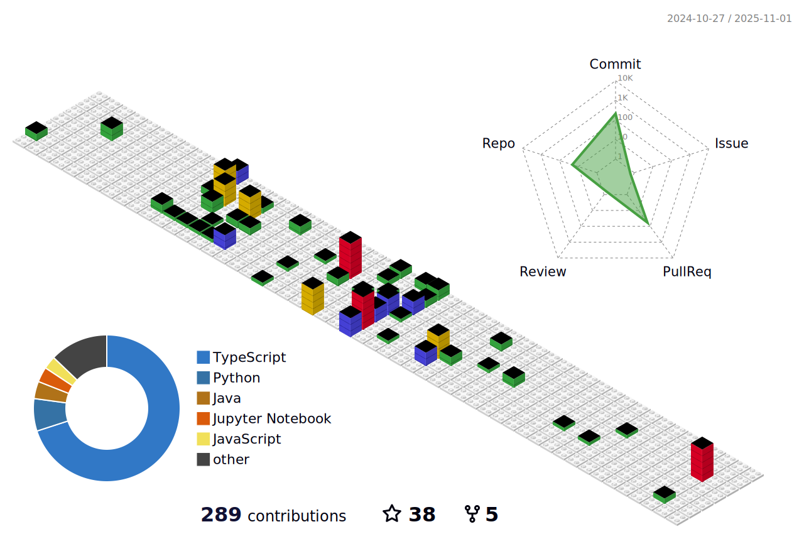

<h1> Hi, I'm Valber Junior </h1>

### I living in Brazil , Rio de Janeiro 
### Dreamer, Adventurer, challenger of reality itself, in search of his dreams although many may say it's impossible, too stubborn to give up easy! For me, the fuel of life is the search for knowledge...  System analysis and development student, passionate about frontend/ fullstack and Javascript and mobile development, always looking to study and learn more and more, after all no one was born knowing and no one will ever know everything 🙂

 

  <a href="https://github.com/ValberJunior">
  
  

 

## Connect with me:

<h2>My Skills:</h2>

         
  
         
         
        
        
  
  
   
  
   
  
   
   
   
   
   
     
 

<!-- <h2>Learning</h2>
 

         

 
 
  

  
 -->  

   

 ****

   

  
  
      
   
